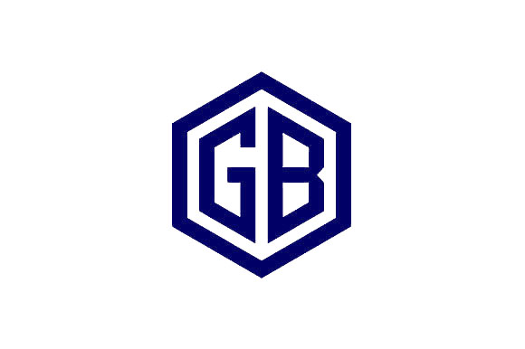

<a name="readme-top">

<br/>

<br />
<div align="center">
  <a href="https://github.com/blanca890/WD-Finals/">
  <!-- TODO: If you want to add logo or banner you can add it here -->
    
  </a>
<!-- TODO: Change Title to the name of the title of your Project -->
  <h3 align="center">Personal Website v.2: A Showcase of Design and Functionality

</h3>
</div>
<!-- TODO: Make a short description -->
<div align="center">
  A showcase of my skills and projects as a student, highlighting my growth and achievements in web design
</div>

<br />

<!-- TODO: Change the zyx-0314 into your github username  -->
<!-- TODO: Change the WD-Template-Project into the same name of your folder -->


---

<br />
<br />

<!-- TODO: If you want to add more layers for your readme -->
<details>
  <summary>Table of Contents</summary>
  <ol>
    <li>
      <a href="#overview">Overview</a>
      <ol>
        <li>
          <a href="#key-components">Key Components</a>
        </li>
        <li>
          <a href="#technology">Technology</a>
        </li>
      </ol>
    </li>
    <li>
      <a href="#rule,-practices-and-principles">Rules, Practices and Principles</a>
    </li>
    <li>
      <a href="#resources">Resources</a>
    </li>
  </ol>
</details>

---

## Overview

<!-- TODO: To be changed -->
<!-- The following are just sample -->
This final project for my web design course is a comprehensive website that demonstrates my ability to create visually appealing, user-friendly, and responsive web pages.

### Key Components
<!-- TODO: List of Key Components -->
<!-- The following are just sample -->
- MultiPage Website/Single Page Website
- Bootstrap
- Home Page, About Me Page, Activity Page, Contact, Credits

### Technology
<!-- TODO: List of Technology Used -->


## Rules, Practices and Principles
1. Always use `WD-` in the front of the Title of the Project for the Subject followed by your custom naming.
2. Do not rename any .html files; always use `index.html` as the filename.
3. Place Files in their respective folders.
4. All file naming are in camel case.
   - Camel case is naming format where there is no white space in separation of each words, the first word is in all lower case while the succeding words first letter are in upper followed by lower cased letters.
   - ex.: buttonAnimatedStyle.css
5. Use only `External CSS`.
6. Renaming of Pages folder names are a must, and relates to what it is doing or data it holding.
7. File Structure to follow below.

```
WD-ProjectName
└─ assets
|   └─ css
|   |   └─ style.css
|   └─ img
|   |   └─ fileWith.jpeg/.jpg/.webp/.png
|   └─ js
|       └─ script.js
└─ pages
|  └─ pageName
|     └─ assets
|     |  └─ css
|     |  |  └─ style.css
|     |  └─ img
|     |  |  └─ fileWith.jpeg/.jpg/.webp/.png
|     |  └─ js
|     |     └─ script.js
|     └─ index.html
└─ index.html
└─ readme.md
```

## Resources

<!-- TODO: Add References -->
| Title | Purpose | Link |
|-|-|-|
| Inpiration design for hero and header |  Personal Portfolio Website using HTML, CSS, JavaScript & Bootstrap 5 for  | https://www.youtube.com/watch?v=cZj0j7rCcek&t=228s |
| Boxicon | For using icons | https://boxicons.com/?query=dr |
| Freepik | Free copyright high quality pictures | https://www.freepik.com/search?format=search&last_filter=query&last_value=person&query=person&selection=1&type=vector|
| Typed animation | For using type animation | https://github.com/mattboldt/typed.js|
| Timeline style  | Used for timeline experience for About me page | https://bestjquery.com/tutorial/timeline/demo145/# |
| Google Font  | For awesome font | https://fonts.google.com/|


